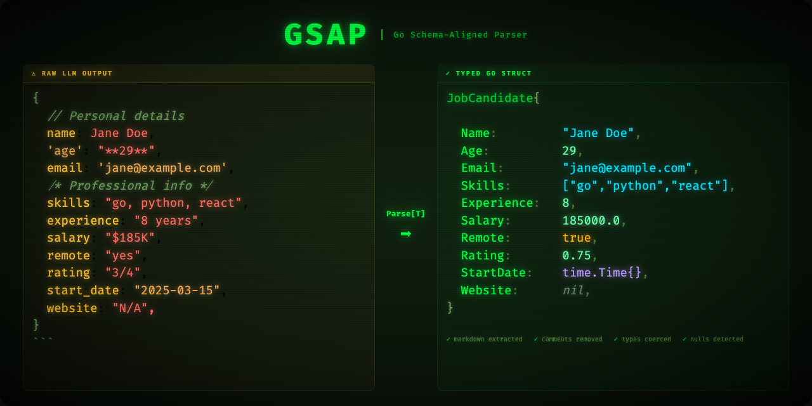

# GSAP - Go Schema-Aligned Parser

[](https://github.com/carpcarp/gsap/actions/workflows/ci.yml)
[](https://pkg.go.dev/github.com/carpcarp/gsap)
[](https://goreportcard.com/report/github.com/carpcarp/gsap)
[](LICENSE)

<p align="center">
  
</p>

A robust JSON parser for Go inspired by BAML's Schema-Aligned Parsing (SAP) algorithm. GSAP handles messy LLM-generated JSON by gracefully recovering from common issues like missing quotes, trailing commas, single quotes, and type mismatches -- so you can focus on your application logic instead of writing JSON cleanup code.

## Features

### JSON Extraction and Fixing

- Extract JSON from markdown code blocks, natural language, and chain-of-thought output
- Fix unquoted keys/values, single/triple quotes, trailing commas, unclosed structures
- Skip comments (`//`, `/* */`)

### Smart Type Coercion

- **Strings to numbers**: `"42"` → `42`, `"1/5"` → `0.2`, `"$1,234.56"` → `1234.56`
- **Numbers with units**: `"30 years"` → `30`, `"$200K"` → `200000`, `"4 GB"` → `4`
- **Markdown stripping**: `"**42**"` → `42`, `"_true_"` → `true`
- **Booleans**: `"yes"`, `"no"`, `"on"`, `"off"`, `"y"`, `"n"`, `"enabled"`, `"disabled"`
- **Null strings**: `"N/A"`, `"none"`, `"null"`, `"unknown"`, `"TBD"` → `nil` for pointer fields
- **Time parsing**: RFC3339, date-only (`"2024-01-15"`), Unix timestamps
- **Comma-separated strings to slices**: `"python, go, rust"` → `["python", "go", "rust"]`
- **Embedded struct** field flattening

### Fuzzy String Matching

- Unicode accent removal (`étude` → `etude`) and ligature expansion (`æ` → `ae`)
- Levenshtein distance-based enum value matching and disambiguation

### Type-Safe Parsing

- Generic `Parse[T]` API -- works with any Go struct
- Automatic field matching via JSON tags with case-insensitive fallback
- Score-based best match selection across multiple JSON candidates

## Installation

```bash
go get github.com/carpcarp/gsap
```

## Quick Start

```go
package main

import (
	"fmt"
	"github.com/carpcarp/gsap"
)

type User struct {
	Name  string `json:"name"`
	Age   int    `json:"age"`
	Email string `json:"email"`
}

func main() {
	// Even with messy input, GSAP parses it correctly
	input := `{name: "Alice", age: "30", email: "alice@example.com"}`

	user, err := gsap.Parse[User](input)
	if err != nil {
		panic(err)
	}

	fmt.Printf("%s is %d years old\n", user.Name, user.Age)
	// Output: Alice is 30 years old
}
```

## Real-World LLM Output

Here's what LLM output actually looks like — and what GSAP does with it:

```go
type JobCandidate struct {
    Name       string    `json:"name"`
    Age        int       `json:"age"`
    Email      string    `json:"email"`
    Skills     []string  `json:"skills"`
    Experience int       `json:"experience"`
    Salary     float64   `json:"salary"`
    Remote     bool      `json:"remote"`
    StartDate  time.Time `json:"start_date"`
    Website    *string   `json:"website"`
    Notes      *string   `json:"notes"`
}
```

Feed this absolute mess to `gsap.Parse`:

````
Sure! Here's the candidate information I extracted:

```json
{
    // Personal details
    name: 'Jane Doe',
    'age': "29 years",
    email: 'jane.doe@example.com',

    /* Professional info */
    skills: "go, python, react, typescript",
    experience: "8 years",
    salary: "$185K",
    remote: "yes",
    start_date: "2025-03-15",

    // Optional fields
    website: "N/A",
    notes: "TBD",
}
```

Let me know if you need anything else!
````

```go
candidate, err := gsap.Parse[JobCandidate](input)
```

**One call. Clean struct:**

| Field | Raw Garbage | Parsed Result | What GSAP Did |
|---|---|---|---|
| `Name` | `name: 'Jane Doe'` | `"Jane Doe"` | Unquoted key, single-quote value |
| `Age` | `"29 years"` | `29` | Stripped units, string to int |
| `Email` | `email: 'jane.doe@example.com'` | `"jane.doe@example.com"` | Unquoted key, single quotes |
| `Skills` | `"go, python, react, typescript"` | `["go", "python", "react", "typescript"]` | Comma-separated string to slice |
| `Experience` | `"8 years"` | `8` | Stripped units, string to int |
| `Salary` | `"$185K"` | `185000` | Currency symbol, K suffix |
| `Remote` | `"yes"` | `true` | Boolean coercion |
| `StartDate` | `"2025-03-15"` | `time.Time{2025-03-15}` | Date string to time.Time |
| `Website` | `"N/A"` | `nil` | Null string detection |
| `Notes` | `"TBD"` | `nil` | Null string detection |

Plus: extracted JSON from markdown code block, skipped `//` and `/* */` comments, removed trailing commas, and auto-fixed the entire malformed structure.

## Usage Examples

### Extracting JSON from LLM Output

```go
input := `Here's the user data:
` + "```json" + `
{
  "name": "Charlie",
  "age": 35,
  "email": "charlie@example.com"
}
` + "```"

user, err := gsap.Parse[User](input)
```

### Fixing Malformed JSON

```go
// Unquoted keys, trailing comma, string-typed number
input := `{name: "David", age: "40", email: david@example.com,}`
user, err := gsap.Parse[User](input)
// user.Age == 40 (coerced from string)
```

### Numbers with Units and Markdown

LLMs often wrap values in markdown or append units. GSAP handles both:

```go
type Candidate struct {
	Name       string  `json:"name"`
	Experience int     `json:"experience"`
	Salary     float64 `json:"salary"`
}

input := `{"name": "**Alice**", "experience": "10 years", "salary": "$200K"}`
c, err := gsap.Parse[Candidate](input)
// c.Name == "Alice", c.Experience == 10, c.Salary == 200000
```

### Time Parsing

```go
type Event struct {
	Name string    `json:"name"`
	Date time.Time `json:"date"`
}

input := `{"name": "Launch", "date": "2024-01-15"}`
event, err := gsap.Parse[Event](input)
// event.Date is a time.Time for Jan 15, 2024
```

### Null String Handling

LLMs often use placeholder strings instead of JSON null:

```go
type Profile struct {
	Name    string  `json:"name"`
	Website *string `json:"website"`
}

input := `{"name": "Bob", "website": "N/A"}`
p, err := gsap.Parse[Profile](input)
// p.Website == nil (recognized as null)
```

### Comma-Separated Strings to Slices

```go
type Developer struct {
	Name   string   `json:"name"`
	Skills []string `json:"skills"`
}

input := `{"name": "Eve", "skills": "python, go, rust"}`
dev, err := gsap.Parse[Developer](input)
// dev.Skills == []string{"python", "go", "rust"}
```

### Parse Quality Scoring

```go
user, score, err := gsap.ParseWithScore[User](input)
if score != nil {
	fmt.Printf("Parse score: %d (lower is better)\n", score.Total())
	fmt.Printf("Coercions applied: %v\n", score.Flags())
}
```

### Manual JSON Fixing

```go
messy := `{name: John, age: 30,}`  // Unquoted, trailing comma
fixed, err := gsap.FixJSON(messy)
// fixed: `{"name": "John", "age": 30}`
```

## How It Works

### 1. JSON Extraction
GSAP first extracts potential JSON from the input text:
1. Try standard JSON parsing
2. Look for markdown code blocks (` ```json ... ``` `)
3. Find balanced JSON objects/arrays in text
4. Fall back to fixing malformed JSON

### 2. JSON Fixing
When JSON is malformed, GSAP's fixing parser:
- Tracks open/close brackets and quotes
- Automatically quotes unquoted keys/values
- Converts single/triple quotes to double quotes
- Removes comments and trailing commas
- Auto-closes incomplete structures

### 3. Type Coercion
After getting valid JSON, GSAP coerces values to match the target type:
- String `"42"` → int `42`, `"$200K"` → float `200000`
- String `"true"`, `"yes"`, `"enabled"` → bool `true`
- Float `3.7` → int `4` (rounds)
- `"1/5"` → float `0.2`
- `"2024-01-15"` → `time.Time`
- `"N/A"` → `nil` for pointer fields
- `"a, b, c"` → `[]string{"a", "b", "c"}`
- Strips markdown: `"**42**"` → `42`
- Fuzzy matches enum values

### 4. Best Match Selection
When multiple parsings are valid, GSAP picks the best using a scoring system:
- Exact matches score lowest (best)
- Type coercions score higher
- Fuzzy matches score highest (worst)

## Configuration

### Strict Mode (No Fixing)

```go
parser := gsap.NewParser().WithStrict(true)
result, _, _ := parser.ParseWithScore(input, reflect.TypeOf(User{}))
```

### Incomplete JSON for Streaming

```go
parser := gsap.NewParser().WithIncompleteJSON(true)
// Allows parsing of incomplete JSON for streaming responses
```

## Integration with instructor-go

GSAP can be used as a drop-in JSON unmarshaler for [instructor-go](https://github.com/567-labs/instructor-go):

```go
import (
	"reflect"
	"github.com/carpcarp/gsap"
)

// GsapUnmarshaler wraps GSAP as a JSON unmarshaler
type GsapUnmarshaler struct{}

func (u *GsapUnmarshaler) Unmarshal(data []byte, v any) error {
	parser := gsap.NewParser()
	result, err := parser.Parse(string(data), reflect.TypeOf(v).Elem())
	if err != nil {
		return err
	}
	reflect.ValueOf(v).Elem().Set(reflect.ValueOf(result))
	return nil
}
```

## Performance

- **Extraction**: O(n) single pass through input text
- **Fixing**: O(n) state machine
- **Coercion**: O(m) where m is number of struct fields
- **Overall**: Near-linear performance for typical LLM outputs

## Comparison to BAML

| Feature | GSAP | BAML |
|---------|------|------|
| JSON fixing | ✅ | ✅ |
| Type coercion | ✅ | ✅ |
| Fuzzy matching | ✅ | ✅ |
| `time.Time` parsing | ✅ | ❌ |
| Null string detection | ✅ | ❌ |
| Markdown stripping | ✅ | ❌ |
| Language | Go (native) | Rust (generates Go) |
| Schema DSL | ❌ (uses structs) | ✅ |
| Streaming support | Partial | ✅ |
| Type safety | ✅ (generics) | ✅ |

## Testing

```bash
go test -v -race ./...
go test -bench=. -benchmem ./...
```

## Roadmap

### v0.2 (Current)

- [x] `time.Time` support (RFC3339, date-only, Unix timestamps)
- [x] Null string handling (`"N/A"`, `"none"`, `"null"` → nil)
- [x] Comma-separated string → slice conversion
- [x] Markdown formatting stripping from values
- [x] Numbers with units (`"30 years"`, `"$200K"`)
- [x] Embedded struct support
- [x] Extended boolean variants (`"y"/"n"`, `"enabled"/"disabled"`)
- [x] Exported score flag constants
- [x] `Score.Flags()` introspection API

### v0.3

- [ ] `io.Reader` streaming for incremental parsing
- [ ] `json.Unmarshaler` / `encoding.TextUnmarshaler` detection
- [ ] Options/Builder pattern for parser configuration
- [ ] Reflection caching for repeated type parsing

### v0.4+

- [ ] Drop-in adapters for OpenAI, Anthropic, and LangChain Go SDKs
- [ ] JSON Schema validation and generation
- [ ] Structured error types with per-field context
- [ ] Union type support
- [ ] Constraint validation

## Contributing

PRs welcome! See [CONTRIBUTING.md](CONTRIBUTING.md) for guidelines.

Focus areas:
- Streaming / `io.Reader` support
- SDK adapter implementations
- Performance optimizations

## License

MIT

## Acknowledgments

Inspired by [BAML](https://www.boundaryml.com)'s Schema-Aligned Parsing algorithm. GSAP extracts this powerful parsing capability into a lightweight, pure-Go library for use with any Go LLM client.
